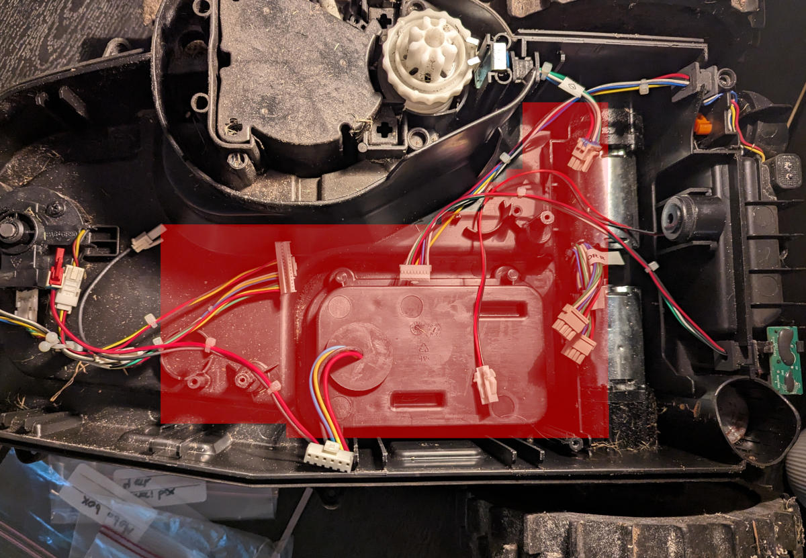
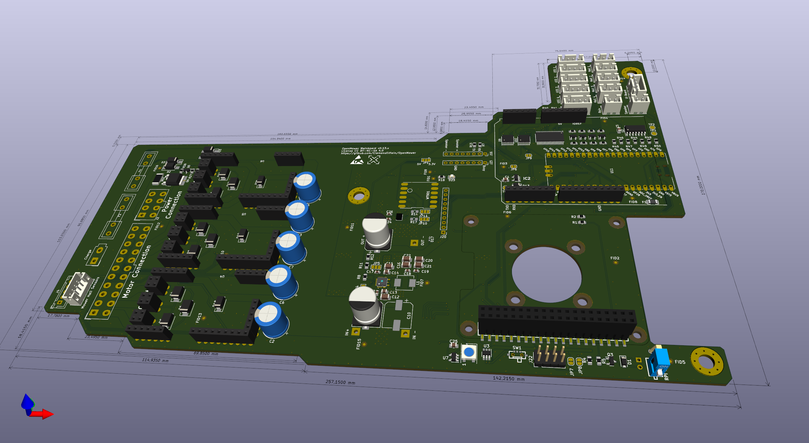
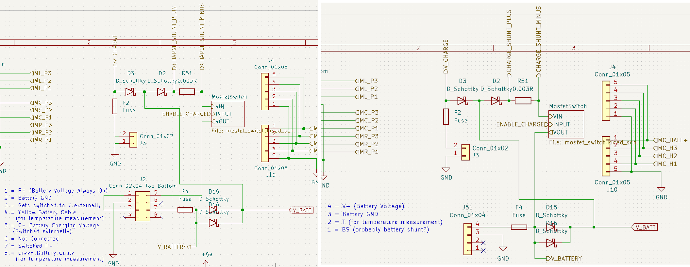
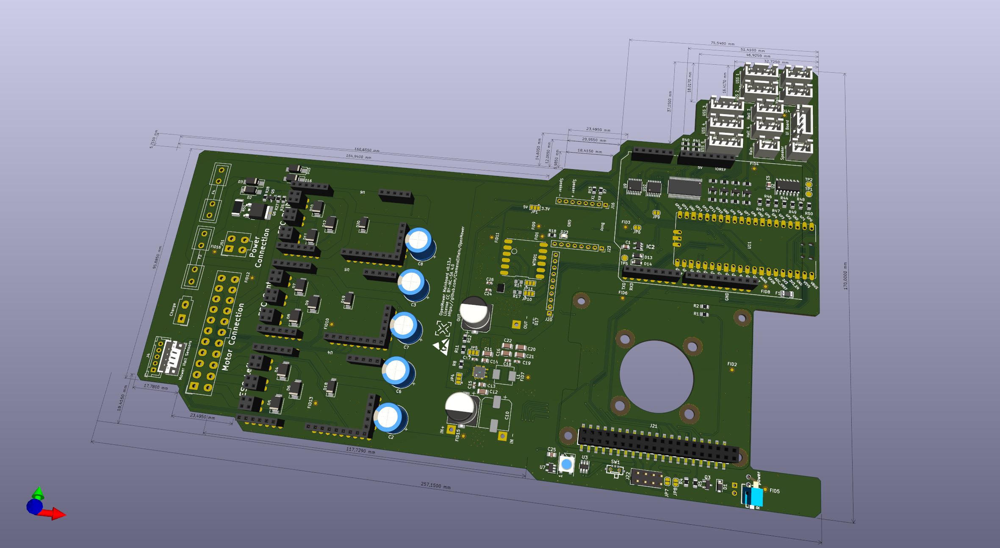
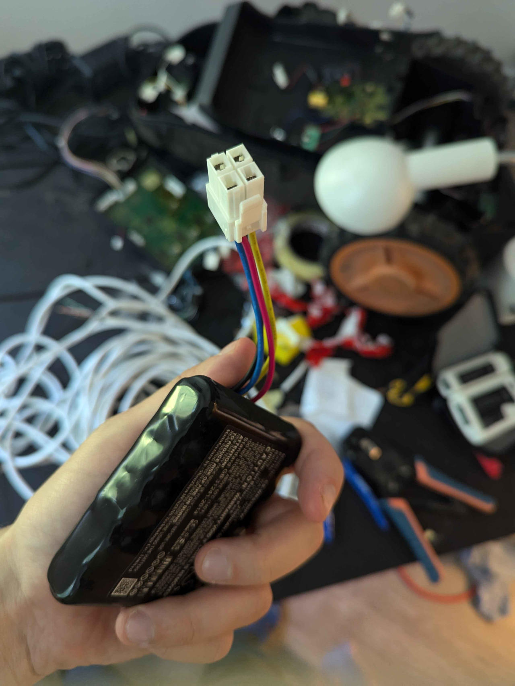

# Notes / Journal

OpenMower on the Worx Landroid WR105SI.

## Budget / shopping list

Check Vermuts shop for parts we need:

https://shop.devops.care/openmower/29-openmower-012x-assembled-board.html

## Dimensions
OG: 170x180

Landroid (Box): 120x190

## Motors

The wheels are powered by Brushless DC (BLDC) motors. 

### Hall effect sensor order test

Tested on right side motor with 5V on hall effect sensor:

- Forward direction: white, blue, green
- Backward direction: green, blue, white

Left side motor: 

- Forward direction: green, blue, white
- Backward direction: white, blue, green

### Motor phase test

Test with power supply on left side motor: B-G to G-W => forward

### Pinout

In conclusion, it seems that the pinouts are as follows:

Power Phases:

    U (Phase A): White
    V (Phase B): Blue
    W (Phase C): Green

Hall Effect Sensors:

    Hall Sensor U/A: White
    Hall Sensor V/B: Blue
    Hall Sensor W/C: Green
    Hall Power (+5V): Red
    Hall Ground (GND): Black

## Mainboard reshaping

Initial observations:

- Mainboard will never fit in the original Landroid motherboard box. Ignoring box from now on and assuming we 3D-print something to hold the new PCB.
- OG board is U-shaped. An L-shaped board in this approximate area seems feasible:
  

Status 31/5-24:

- Forked OpenMower and started reshaping mainboard: [https://github.com/tausen/OpenMower/tree/landroid](https://github.com/tausen/OpenMower/tree/landroid)
- The three motor controllers and connectors north of those have been rotated counterclockwise and moved west. Moved fuses and charging connector out far west. Looks like this now (rev 9017d31):
  
- There's about 15mm between motor controller caps and buck converter that can probably be squeezed if we need it to be narrower. Currently occupied by a mounting hole (accounting for about 10mm and will probably be moved) and a large `V_BATT` zone that is unaltered from the OG OpenMower mainboard (the remaining 5mm). Would it be safe to squeeze that zone?

Status 1/6-24:

- Initial fit check seems promising. Did a slight resize in bottom mid to get some more freedom when placing the PCB in the Landroid.

Status 23/06-24:

- Mainboard schematic update started for Landroid battery instead of more advanced Yardforce battery pack
- NOTE: connector footprint must be updated, just used an equivalent molex for now. The housing on the battery is actually the [JST VLP-04V](https://www.jst-mfg.com/product/pdf/eng/eVL1.pdf). More models on [JSTs website](https://www.jst-mfg.com/product/index.php?series=264)
  - The battery pinout is 1: BS (yellow), 2: B+ (red), 3: GND (black), 4: T (blue)

Next tasks:

- [x] Mounting holes: Drop mounting holes, will "click" PCB into box
- [x] Fit check: print board outline in 1:1 on A4, check -- OK, looks good
- [x] Fit check: final height needed for motherboard? Will this be an issue?
  - Seems to be something like 5cm clearance between bottom and top shield. Components on the mainboard seem to be at most 2cm high. Need some clearance for wires on connectors
- [ ] Any production parameters we should worry about? Like board thickness, copper weight, via covering, ...
- [ ] Fiducials: moved some around, where should they be?
- [ ] Get quote from JLC PCB incl components
  - Almost all components are registered as "extended components", which means +2.8 EUR per part, bringing the price way up. Looks like many of these are for standard components, so this can probably be resolved by going part by part and using some that are in the JLC PCB library. Perhaps the OG part selection is based on PCBWays library?
- [x] Seems like two speaker pin headers are supposed to fit DFPlayer Mini MP3 Player: https://wiki.dfrobot.com/DFPlayer_Mini_SKU_DFR0299
- [x] What about the IMU pin header?
  - IMU is a small SMD IC. The pin header seems to be for debugging or something...
- [ ] Any other pin headers etc that have been moved that have dependencies I've ignored?
  - [ ] Looks like the IMU and speaker pin headers might be a bit close for no reason. Could shift that a bit.
- [x] What are the implications on the OpenMower mainboard which expects 28 V Vbatt, when the Landroid batteries are 20 V
  - Need to update charge stop threshold, but otherwise seems this should be fine: xESC2 doesnt care, Landroid motors are 20 V, voltage converter supports much lower voltage
- [ ] Any connectors that should be different with the Landroid? E.g. motors, battery, .. Probably need some longer wires anyway?
  - [ ] Landroid battery seems to be a JST VLP-04V. But distance from battery to connector is way too long for original Landroid battery cable... What to do?
  - [ ] Landroid stop sensor
  - [ ] Landroid motor connectors

## Motor controllers

Buy complete or produce ourselves?

BOM: https://octopart.com/bom-tool/WcUXLmRi

- [ ] Get quote from JLC PCB (or others) incl components
- [x] Do we need the CAN chip mounted?
  - No, the CAN chip is not in use on the OG OpenMower mainboard.
- [ ] Why is the center motor controller different from the two others?
  - https://shop.devops.care/openmower/29-openmower-012x-assembled-board.html
  - Different configuration: https://openmower.de/docs/knowledge-base/configure-xesc/

## New mainboard box

Need to design a box for the reshaped mainboard.

- Ensure mounting holes fit somewhere we can place a screw in the Landroid
- How weather resilient must the new box be? Original Landroid motherboard is protected by epoxy, but connectors and motors etc are not particularly protected.

Plan:

- [ ] Design baseplate for mounting mainboard
- [ ] Do test 3D print, fit check incl height
- [ ] Box

## Charger

- [ ] How does it work? Can we reuse the old basestation?
  - [x] Battery voltage/type in OG OpenMower vs OG Landroid?
    - OG OpenMower: 28 V Li-Ion, DC-DC converter set at 29.2 V. So probably 7 cells charged to approx 4.2 V
    - Landroid: 20 V Li-Ion, 5 cells. So each cell charged to approx 4.2 V that's 21 V. 
- [ ] Why does the old charger not work?
- [ ] Battery connector is different and has fewer connections
- [ ] Charger voltage sense is dimensioned for 28 V battery, not 20 V
- [ ] Seems feasible to make OpenMower DC-DC converter fit, but will require customized carrier board adjusted for the Landroid dock mounting holes

OpenMower uses cheap china DC-DC converter, XL4016. Some issues [reported](https://discord.com/channels/958476543846412329/961803746399101008/1209589195589423214) on [discord](https://discord.com/channels/958476543846412329/961803746399101008/1250042767137308784) with random devices from ebay/aliexpress. [Suggestion](https://discord.com/channels/958476543846412329/961803746399101008/1250706216867332207) is to buy from AZDelivery [on Amazon](https://www.amazon.de/gp/aw/d/B086W79QQ8).

Judging from the robot-to-battery connector J2, the OG OpenMower battery pack seems to have some logic, probably disabling an output when charging. The mainboard seems to switch between using the battery voltage and the charger voltage. The Landroid battery pack only has V+, GND, T and BS. Q: can we just ignore this switching logic and always use V+ from the batteries, even if we're charging? Ask on discord and get some input.

Landroid battery teardown: https://www.roboter-forum.com/threads/worx-landroid-wa3230-battery-pack-disassembly.21636/

Charger current sense resistor etc. is dimensioned for 28 V. We need to adjust this sense voltage to match the reduced battery voltage.

## GPS antenna mounting

Where? How?

## Wires and connectors

Crimps, connectors, wire lengths, ...

# Other TODOs

- Buy a crimp tool or two - OG OpenMower seems to use Molex Minifit Jr. and JST-XH
  - Maybe this kit for JST: https://www.amazon.de/-/en/gp/product/B09X111BK5
- 4 New screws for battery box.

# Resources
Landroid-Board: BLDC Motor Controller: https://www.onsemi.com/pdf/datasheet/mc33035-d.pdf
NXP application note on BLDC motor control with hall effect sensors: https://www.nxp.com/docs/en/application-note/AN4413.pdf
RTK: https://www.ardusimple.com/rtk-explained/
